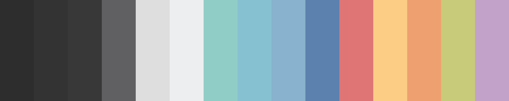

     

---

# 2.0.0 (2016-10-29)
**The milestone [Version 2.0.0](https://github.com/arcticicestudio/northem/milestone/2) release!**

The whole project, including both sub-palettes and related sub-projects/ports have been rewritten and cleaned up to adapt to the new project setup like the [Nord](https://github.com/arcticicestudio/nord) project.

## Features
### Naming Scheme
**Color names**
The current naming scheme, where each color got an individual name based on the value, has been replaced with an numbered format.  
Example: `darkest-gray` has been renamed to `northem0`, `dark-gray` to `northem1`.  
This goes on with a continuous numerating where the current position of a color represents its number.

**Components**
Next to this, the color palette has been divided into four named components to represent the different color effects where each component contains a different amount of colors:  
  1. **Dark Water** `northem0` - `northem3`  
  2. **Light Wind** `northem4` - `northem6`  
  3. **Ice** `northem7` - `northem10`  
  4. **Rainbow** `northem11` - `northem15`

This naming convention allows an uncomplicated use for terminals and preserves the compatibility to similar projects like [base16](chriskempson.com/projects/base16).

The X11 color scheme names and RGB value variables has been removed, but X11 color names are still included in the Sass- and LESSCSS source documentations.

### New color
A new color has been added to close the gap of the missing sixteenth color.  
The value of the color is `#CACACA` which has been added to the *Light Wind* component.  
This color is calculated from the components base color `#DEDEDE` via the Sass method `darken(#DEDEDE, 8%)`.

### Source Formats
**Sass**
All [Sass](http://sass-lang.com) sources has been documented via [SassDoc](http://sassdoc.com) and a `template-css.scss` is available to compile a CSS file with all color variables which is compatible to the CSS specification.  
The SassDoc is configurable via the `.sassdocrc` file.
(@arcticicestudio, #5, PR #16, aadccc12)

**LESSCSS**
All [LESSCSS](http://lesscss.org) sources has been documented via [KSS](http://warpspire.com/kss).
(@arcticicestudio, #6, PR #17, 46c7e316)

**Native**
All native files has been recreated containing the new color and new color naming scheme.
(@arcticicestudio, #7, PR #14, 17fa045d)
  
### Build Tools
**Gulp**
Introduced a [Gulp](gulpjs.com) file to compile Sass sources to CSS, provide a local live-server by watching the filesystem for changes and build the new [SassDoc](http://sassdoc.com).  
(@arcticicestudio, #9, PR #12, b4d44713)

**Travis CI and Circle CI**
Added `.travis.yml` and `circle.yml` configuration files for continuous integration web services.
(@arcticicestudio, #8, PR #13, 0ec41baa)

### NPM
A `package.json` file has been added to provide project meta data and dependencies for a release as a [NPM](http://npmjs.com) package.
(@arcticicestudio, #10, PR #11, 7e48d1ec)

### Assets
All project branding assets has been removed and replaced with new, modern SVG and AI files.
(@arcticicestudio, #4, PR #15, 4138543f)

### Documentations
All project documentations have been rewritten.  
The project license for the code has been changed to the [Apache 2.0](http://www.apache.org/licenses/LICENSE-2.0) license.
(@arcticicestudio, #4, PR #15, 4138543f)

### Git
The `.gitignore` and `.gitattributes` files have been rewritten to remove the high amount of unused pattern and comments.
(@arcticicestudio, #4, PR #15, 4138543f)

# 1.0.0 (2016-04-16)

**Syntax Preview**  

## Native
  - Added the "[GIMP](https://www.gimp.org)/[Inkscape](https://inkscape.org) Palette" file format (`.gpl`)
  - Added the "[Adobe Swatch Exchange](https://helpx.adobe.com/illustrator/using/using-creating-swatches.html)" file format (`.ase`)
  - Added the "Alias/WaveFront Material" file format (`.mtl`)
  - Added the "[Gpick](http://www.gpick.org) Palette" file format (`.gpa`)
  - Added the binary exported [GIMP](https://www.gimp.org) XCF project image `northem.png` and `northem-large.png`
  

## Non-Native
  - Implemented the [Sass](http://sass-lang.com) file format (`.scss`)
  - Implemented the [LESSCSS](http://lesscss.org) file format (`.less`)
  - Implemented the [JSON](http://json.org/) file format (`.json`)
  - Implemented the [XML](https://www.w3.org/XML) file format (`.xml`)

# 0.0.0 (2016-04-16)
**Repository Reinitialization**
