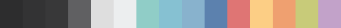
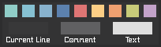

Northem
=======

### Description
Northem is a north-bluish dark color palette designed by [Arctic Ice Studio](http://arcticicestudio.com).  
Optimized for syntax highlighting and UI projects.

### Variations
  -  [Northem Dark](https://github.com/arcticicestudio/northem-dark)
  -  [Northem Light](https://github.com/arcticicestudio/northem-light)

### Projects
Based on this the following projects are available:

#### Syntax
  - <a href="https://github.com/arcticicestudio/northem-intellij-idea-syntax"> Northem - IntelliJ IDEA Syntax</a>   
  - <a href="https://github.com/arcticicestudio/northem-atom-syntax"> Northem - Atom Syntax</a>   
  - <a href="https://github.com/arcticicestudio/northem-eclipse-syntax"> Northem - Eclipse Syntax</a>   
  - <a href="https://github.com/arcticicestudio/northem-gedit-syntax"> Northem - Gedit Syntax</a> 
  - <a href="https://github.com/arcticicestudio/northem-notepadplusplus-syntax"> Northem - Notepad++ Syntax</a> 

#### UI
  - <a href="https://github.com/arcticicestudio/northem-atom-ui"> Northem - Atom UI</a>   
  - <a href="#"> Northem - GTK</a> (in drafting) 

#### Libraries
**Java**  
  - <a href="https://github.com/arcticicestudio/northem-java"> Northem - Java</a>   

Visit the [official website](http://arcticicestudio.com/northem) (currently under construction) for more information.

### File Formats
#### Non-Native
  - [LESSCSS](http://lesscss.org) `.less`
  - [Sass](http://sass-lang.com) `.scss`
  - [JSON](http://json.org/) `.json`
  - [XML](https://www.w3.org/XML) `.xml`

#### Native
  - GIMP/Inkscape Palette `.gpl`
  - Adobe Swatch Exchange `.ase`
  - Alias/WaveFront Material `.mtl`
  - Gpick Palette `.gpa`

### Version
[`1.0.0`](https://github.com/arcticicestudio/northem/releases/latest)  

For older versions check out the [GitHub Repository](https://github.com/arcticicestudio/northem) and the [official website](http://arcticicestudio.com/northem) (currently under construction).

### Changelog
[`1.0.0`](CHANGELOG.md)

### Development
#### Workflow
This project follows the [gitflow](http://nvie.com/posts/a-successful-git-branching-model) branching model.

#### Specifications
This project follows the [Arctic Versioning Specification (ArcVer)](https://github.com/arcticicestudio/arcver).

### Dependencies
#### Development
**Engines**
  - [`git@2.8.*`](https://git-scm.com)

**Specifications**  
  - [`arcver@0.8.0`](https://github.com/arcticicestudio/arcver)

**Skeletons**
  - [`glacier-git@0.23.0`](https://github.com/arcticicestudio/glacier-git)

### Recommendations
#### Fonts
##### Syntax
This theme matches the Open Source font [Source Code Pro](https://typekit.com/fonts/source-code-pro).  
Visit the [GitHub Repository](https://github.com/adobe-fonts/source-code-pro) for more information.

##### UI
This theme matches the Open Source font [Roboto](http://www.google.com/fonts/specimen/Roboto).  
Visit the [GitHub Repository](https://github.com/google/fonts/tree/master/apache/roboto) for more information.

### Contribution
Please report issues/bugs, suggestions for improvements and feature requests to the [issuetracker](https://github.com/arcticicestudio/northem/issues).

### Author
The [Northem](https://github.com/arcticicestudio/northem) project is developed and authored by [Arctic Ice Studio](http://arcticicestudio.com).

### Copyright
<a href="mailto:development@arcticicestudio.com"> Copyright &copy; 2015-2016 Arctic Ice Studio</a>

### License
 

---

### References
  - [Sass](http://sass-lang.com)
  - [LESSCSS](http://lesscss.org)  
  - [X Window System Documentation](http://www.x.org/releases/X11R7.7/doc)
  - [Arctic Versioning Specification](http://specs.arcticicestudio.com/arcver) (ArcVer)
  - [gitflow](http://nvie.com/posts/a-successful-git-branching-model)
  - [Glacier - Git](https://github.com/arcticicestudio/glacier-git)
